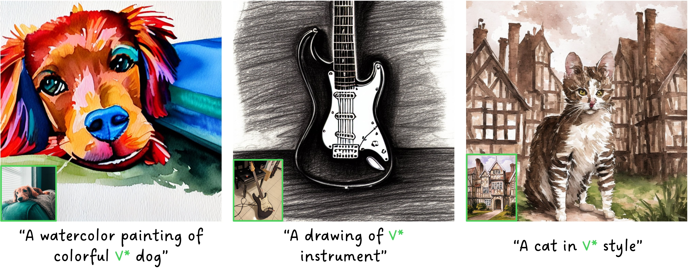

# TextBoost: Towards One-Shot Personalization of Text-to-Image Models via Fine-tuning Text Encoder

[](https://arxiv.org/abs/2409.08248)
[](https://textboost.github.io)

<div style="text-align: center;">
  
</div>

Abstract: *Recent breakthroughs in text-to-image models have opened up promising research avenues in personalized image generation, enabling users to create diverse images of a specific subject using natural language prompts. However, existing methods often suffer from performance degradation when given only a single reference image. They tend to overfit the input, producing highly similar outputs regardless of the text prompt. This paper addresses the challenge of one-shot personalization by mitigating overfitting, enabling the creation of controllable images through text prompts. Specifically, we propose a selective fine-tuning strategy that focuses on the text encoder. Furthermore, we introduce three key techniques to enhance personalization performance: (1) augmentation tokens to encourage feature disentanglement and alleviate overfitting, (2) a knowledge-preservation loss to reduce language drift and promote generalizability across diverse prompts, and (3) SNR-weighted sampling for efficient training. Extensive experiments demonstrate that our approach efficiently generates high-quality, diverse images using only a single reference image while significantly reducing memory and storage requirements.*


## Installation

Our code has been tested on `python3.10` with `NVIDIA A6000 GPU`. However, it should work with the other recent Python versions and NVIDIA GPUs.

### Installing Python Packages

We recommend using a Python virtual environment or anaconda for managing dependencies. You can install the required packages using one of the following methods:

#### Using `pip`:
```sh
python -m venv .venv
source .venv/bin/activate
pip install -r requirements.txt
```

#### Using `conda`:

```sh
conda env create -f environment.yml
conda activate textboost
```

For the exact package versions we used, please refer to [requirements.txt](requirements.txt) file.


## Training

To get started, you will need to download the human-written prompts dataset. Follow the instructions from [InstructPix2Pix](https://github.com/timothybrooks/instruct-pix2pix) to download `human-written-prompts.jsonl`, and then place it in the `data` directory.

We used a single image from each instance of [DreamBooth](https://github.com/google/dreambooth) benchmark.
You can find images for each instance in [data/dreambooth_n1.txt](data/dreambooth_n1.txt).
We provided a simple [script](split_dreambooth.py) to help automate this.

```sh
git clone https://github.com/google/dreambooth
python split_dreambooth.py --dreambooth-dir dreambooth/dataset
```

If not specified, the code will attempt to use a first `n=--num_samples` images in the directory.

**Notice**: Our method was primarily tested using Stable Diffusion v1.5; however, this version is currently unavailable. You can use another version such as v1.4.

To train the model, you can use the following command:

```sh
accelerate launch train_textboost.py \
--pretrained_model_name_or_path=CompVis/stable-diffusion-v1-4 \
--instance_data_dir data/dreambooth_n1_train/dog  \
--output_dir=output/tb/dog \
--instance_token '<dog> dog' \
--class_token 'dog' \
--validation_prompt 'a <dog> dog in the jungle' \
--validation_steps=50 \
--placeholder_token '<dog>' \
--initializer_token 'dog' \
--learning_rate=5e-5 \
--emb_learning_rate=1e-3 \
--train_batch_size=8 \
--max_train_steps=250 \
--checkpointing_steps=50 \
--num_samples=1 \
--augment=paug \
--lora_rank=4 \
--augment_inversion
```

Alternatively, you can also use `torchrun` command. Here's an example:

```sh
CUDA_VISIBLE_DEVICES=0 torchrun --rdzv-backend=c10d --rdzv-endpoint=localhost:0 --nproc-per-node=1 train_textboost.py \
--pretrained_model_name_or_path=CompVis/stable-diffusion-v1-4 \
--instance_data_dir data/dreambooth_n1_train/dog  \
--output_dir=output/tb/dog \
--instance_token '<dog> dog' \
--class_token 'dog' \
--validation_prompt 'a <dog> dog in the jungle' \
--validation_steps=50 \
--placeholder_token '<dog>' \
--initializer_token 'dog' \
--learning_rate=5e-5 \
--emb_learning_rate=1e-3 \
--train_batch_size=8 \
--max_train_steps=250 \
--checkpointing_steps=50 \
--num_samples=1 \
--augment=paug \
--lora_rank=4 \
--augment_inversion
```

### Training on All Instances

To train the model on all DreamBooth instances, run the following command:

```sh
python run_textboost_db.py
```

## Inference

After training, you can generate images using the following command:

```sh
python inference.py output/tb/dog --model CompVis/stable-diffusion-v1-4 --prompt "photo of a <dog> dog" --output test.jpg
```

## Evaluation


To evaluate the trained model, ensure that the folder structure follows the format shown below:

```
.
├── output
│   └── tb-sd1.5-n1
│      ├── backpack
│      ├── backpack_dog
│      ...
│      └── wolf_plushie
└── ...
```

Once the folder structure is correctly set up, run the following command:

```sh
CUDA_VISIBLE_DEVICES=0 python eval_dreambooth.py output/tb-sd1.5-n1 --token-format '<INSTANCE> SUBJECT'
```

* Here, `<INSTANCE>` can be replaced with your own modifier token (e.g. `<new>`).

## Citation

```bibtex
@article{park2024textboost,
  title   = {TextBoost: Towards One-Shot Personalization of Text-to-Image Models},
  author  = {Park, NaHyeon and Kim, Kunhee and Shim, Hyunjung},
  journal = {arXiv preprint},
  year    = {2024},
  eprint  = {arXiv:2409.08248}
}
```

## License

All materials in this repository are available under the [MIT License](LICENSE).
