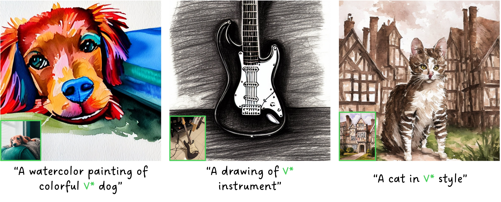

# TextBoost: Boosting Text Encoder for Personalized Text-to-Image Generation

[](https://arxiv.org/abs/2409.08248)
[](https://textboost.github.io)

> **Note:** This repository has been updated to the TMLR accepted version, which significantly revised the method from the initial arXiv preprint. You can find the old version in the [`v1` branch](https://github.com/nahyeonkaty/textboost/tree/v1).

<div style="text-align: center;">
  
</div>

Abstract: *In this paper, we introduce TextBoost, an efficient one-shot personalization approach for text-to-image diffusion models. Traditional personalization methods typically involve fine-tuning extensive portions of the model, leading to substantial storage requirements and slow convergence. In contrast, we propose selectively fine-tuning only the text encoder, significantly improving computational and storage efficiency. To preserve the original semantic integrity, we develop a novel causality-preserving adaptation mechanism. Additionally, lightweight adapters are employed to locally refine text embeddings immediately before their interaction with cross-attention layers, greatly enhancing the expressiveness of text embeddings with minimal computational overhead. Empirical evaluations across diverse concepts demonstrate that \tb achieves faster convergence and substantially reduces storage demands by minimizing the number of trainable parameters. Furthermore, \tb maintains comparable subject fidelity, superior text fidelity, and greater generation diversity compared to existing methods. We show that our proposed method offers an efficient, scalable, and practically applicable solution for high-quality text-to-image personalization, particularly beneficial in resource-constrained environments.*

## Installation

Our code has been tested on `python 3.12` with `NVIDIA A6000 GPU`. However, it should work with the other recent Python versions and NVIDIA GPUs.

### Installing Python Packages

We recommend using a Python virtual environment for managing dependencies. You can install the required packages using the following method:

```sh
python -m venv .venv
source .venv/bin/activate
pip install -e .
```

For the exact package versions we used, please refer to [pyproject.toml](pyproject.toml) file.


## Training & Evaluation

### Datasets

To get started, you will need to download the required datasets (e.g., DreamBooth, StyleDrop). We provide a simple script to help automate this:

```sh
python scripts/download_datasets.py --dataset all
```

This will download the images into the `datasets/` directory.

### Train & Evaluate

We provide unified scripts that handle both the training and evaluation loops. To run the full pipeline for Stable Diffusion, you can use the `run_sd.py` command:

```sh
python run_sd.py \
  --model sd21base \
  --output_root outputs \
  --data_root datasets \
  --lora_rank 1
```

This script will automatically iterate over instances, run the fine-tuning process, generate images, and save them in the `outputs/` directory. 

We also provide similar scripts for other model architectures such as SDXL (`run_sdxl.py`) and SANA (`run_sana.py`).


## Citation

```bibtex
@article{park2024textboost,
  title   = {Boosting Text Encoder for Personalized Text-to-Image Generation},
  author  = {Park, NaHyeon and Kim, Kunhee and Shim, Hyunjung},
  journal = {Transactions on Machine Learning Research},
  year    = {2026}
}
```

## License

All materials in this repository are available under the [MIT License](LICENSE).
